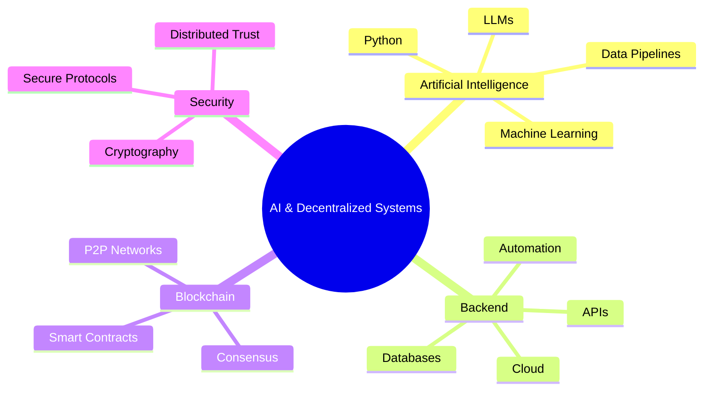

  <!-- You can replace this banner URL with your own pixel-art or cyberpunk GIF -->
  

    

  <h1>Hi 👋, I'm José Antônio</h1>
  
  <h3>AI & Decentralized Systems Developer</h3>

  

    Building reliable backend systems, intelligent automations, and exploring the decentralized web.
  

 

 

---

<!-- ABOUT ME SECTION -->

  
  
  <h2 align="center">🚀 About Me</h2>

  
<strong>José Antônio</strong>, here — a Computer Engineering student heavily focused on backend architecture and next-generation technologies.

  
  
I enjoy building intelligent applications, production-ready APIs, and continuously pushing my boundaries by exploring the intersection of AI and Web3.

  
Currently, I'm diving deep into:

  <ul>
    <li>🎓 <strong>Academics:</strong> Computer Engineering Student.</li>
    <li>🚀 <strong>Current Focus:</strong> Deepening my knowledge in <strong>Artificial Intelligence (Python)</strong> and Automations.</li>
    <li>🌐 <strong>Long-Term Vision:</strong> Building distributed systems, smart contracts, cryptography, and integrating LLMs/AI in decentralized networks.</li>
    <li>💡 <strong>Interests:</strong> Consensus algorithms, P2P networks, data pipelines for AI, and cryptographic security.</li>
  </ul>

 
 

 

<!-- CONNECT SECTION -->

  <h2>🤝 Connect</h2>
  
  
  
  

 

<!-- TECH STACK SECTION -->

  <h2>💻 Tech Stack</h2>
  
  
<b>Core Focus:</b>

  

    
    
    
    
    
  

   

  
<b>Languages, Databases & Infra:</b>

  <!-- Using Skillicons for a clean, uniform, and modern icon look like your reference -->
  
    
  

 

 

 

  <i>Let's build the future, one block of code at a time.</i> 🚀

